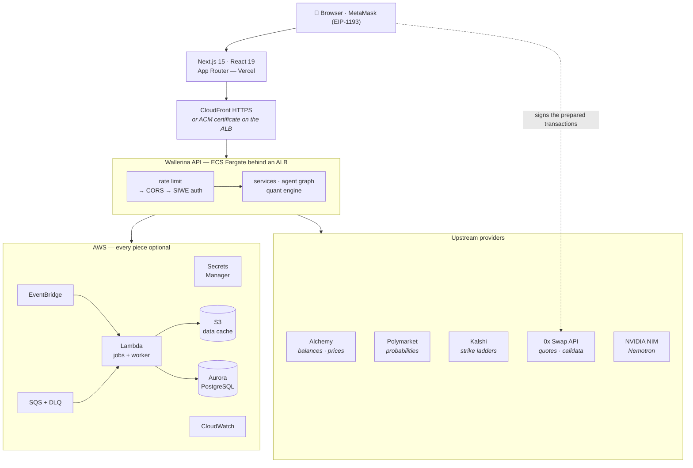
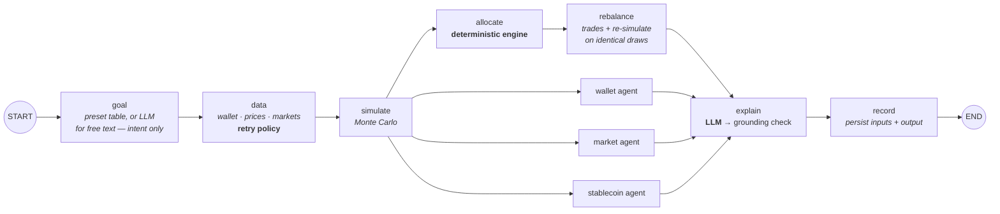
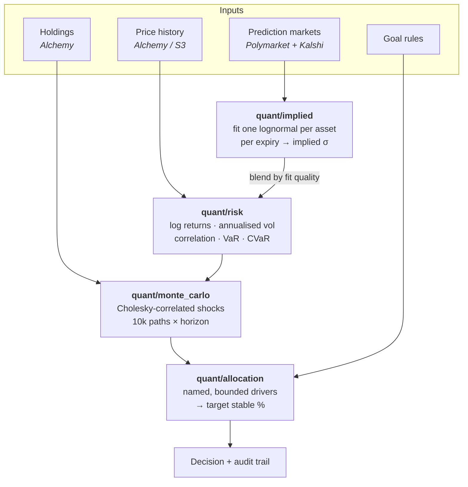
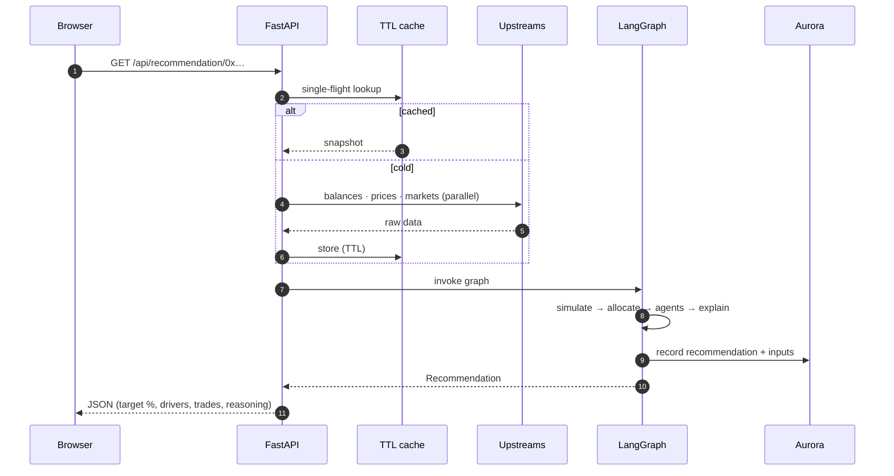
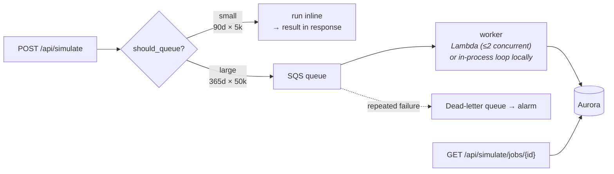
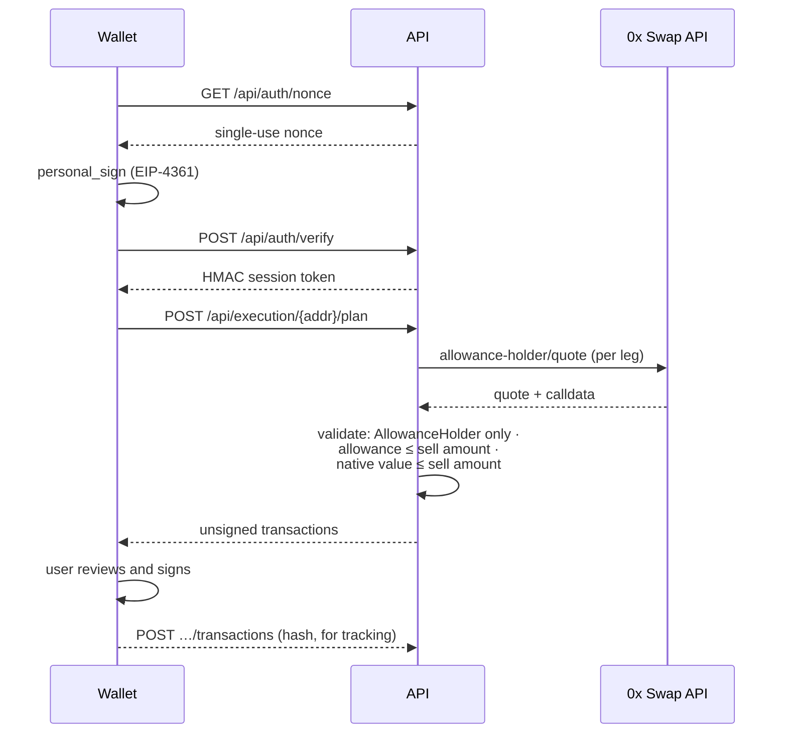

<div align="center">
  <br />
    
  <br />

  <h1 align="center">Wallerina</h1>

  <div align="center">
    <strong>Dynamic crypto portfolio risk management.</strong>
    <br />
    <sub>Balance crypto exposure with stablecoin protection using real-world market signals and simulated outcomes.</sub>
  </div>

  <br />

  <div>
    
    
    
    
    
  </div>
</div>

<br />

## 📋 <a name="table">Table of Contents</a>

1. ✨ [Introduction](#introduction)
2. 💡 [The Idea](#idea)
3. 🪙 [Why Stablecoins](#stablecoins)
4. 📊 [How Wallerina Works](#how-it-works)
5. 🏗️ [System Architecture](#architecture)
6. 🔋 [Features](#features)
7. 🧠 [The Philosophy](#philosophy)

---

## <a name="introduction">✨ Introduction</a>

Crypto markets can move violently in a matter of hours.

A portfolio that feels perfectly reasonable today can become heavily exposed to downside risk tomorrow. At the same time, moving everything into stablecoins whenever the market looks uncertain can mean giving up potential upside.

**Wallerina is built around this balance.**

It looks at your wallet, your financial goal, and the current market environment to determine whether your portfolio is taking an appropriate amount of risk.

Instead of relying on a permanent allocation such as `60% crypto / 40% stablecoins`, Wallerina adapts its recommendation as market conditions change.

> **The goal isn't to predict the market. It's to understand your exposure to it.**

---

## <a name="idea">💡 The Idea</a>

Imagine your portfolio currently looks like this:

```text
┌─────────────────────────────────────┐
│          YOUR PORTFOLIO             │
│                                     │
│     75% Volatile Crypto             │
│     25% Stablecoins                  │
└─────────────────────────────────────┘
```

When the market is calm, that allocation might make sense.

But suppose volatility increases and several major market events begin carrying higher probabilities.

Your portfolio hasn't changed.

**The risk around it has.**

Wallerina asks:

> **"Is the amount of risk I'm currently carrying still appropriate for my goal?"**

It then evaluates the current environment and simulates thousands of possible outcomes before producing a recommendation.

For example:

```text
Current Allocation
75% Crypto / 25% Stable

          ↓

Higher Market Risk

          ↓

Simulated Outcomes

          ↓

Recommended Allocation
55% Crypto / 45% Stable
```

The allocation is dynamic rather than permanently fixed.

*The percentages shown above are illustrative and are not financial advice.*

---

## <a name="stablecoins">🪙 Why Stablecoins?</a>

Stablecoins are crypto assets designed to maintain a relatively stable value, commonly against a fiat currency such as the US dollar.

They provide something useful for portfolio management:

> **Crypto-native liquidity without the same level of price volatility as most cryptocurrencies.**

Suppose a portfolio contains `$10,000`.

### 100% Volatile Crypto

If the crypto portion falls by 40%:

```text
$10,000
   ↓
$6,000
```

### 60% Crypto + 40% Stablecoins

If the crypto portion falls by 40%:

```text
$6,000 Crypto
$4,000 Stablecoins
        ↓
$7,600 Total
```

The stablecoin allocation doesn't eliminate losses.

It simply means that **less of the portfolio is exposed to the volatile asset movement**.

The challenge is figuring out **how much stablecoin exposure is appropriate right now**.

That's the problem Wallerina focuses on.

---

## <a name="how-it-works">📊 How Wallerina Works</a>

Wallerina combines three perspectives:

### 1. Your Portfolio

It starts with what you actually own.

```text
Wallet
  ↓
Asset Holdings
  ↓
Volatile vs Stable Exposure
  ↓
Current Portfolio Risk
```

### 2. The Market

It then looks beyond your wallet.

Market prices, historical volatility, and real-world event probabilities provide signals about the current environment.

Prediction markets are particularly useful here because they provide continuously changing probabilities around real-world events.

These probabilities are **signals**, not direct predictions of crypto prices.

### 3. Possible Futures

Instead of assuming one future, Wallerina explores thousands of them.

```text
             Current Conditions
                     │
                     ▼
            ┌─────────────────┐
            │ Risk Assessment │
            └────────┬────────┘
                     │
                     ▼
             10,000 Scenarios
                     │
          ┌──────────┼──────────┐
          ▼          ▼          ▼
       Upside      Normal     Downside
          │          │          │
          └──────────┼──────────┘
                     ▼
              Risk Distribution
                     │
                     ▼
             Portfolio Action
```

This allows the system to reason about **the range of outcomes**, rather than pretending it knows exactly what will happen.

---

## <a name="architecture">🏗️ System Architecture</a>

Wallerina is a three-tier system: a **Next.js** client, a **FastAPI** service that holds the
quantitative engine and the agent graph, and an **optional AWS layer** that adds persistence,
caching, scheduling and queued compute around it.

One rule shapes every box below:

> **Deterministic code produces every number. The language model only reads intent and writes prose.**

### 1. System context



The browser never sends Wallerina a private key. Swap calldata is built server-side, validated,
then handed back for the wallet to sign — see [Execution](#execution).

### 2. Backend layers

Dependencies point downward only. Nothing in `quant/` imports FastAPI, AWS or HTTP, which is why
the engine is directly unit-testable.

```text
┌──────────────────────────────────────────────────────────────────────────────┐
│  main.py — FastAPI app                                                       │
│  26 routes · sliding-window rate limiter · CORS · SIWE bearer auth           │
├──────────────────────────────────────────────────────────────────────────────┤
│  agents/            pipeline (LangGraph) · goal · analysts · judgement ·     │
│                     grounding · llm (NVIDIA NIM)                             │
├──────────────────────────────────────────────────────────────────────────────┤
│  services/          analysis · chat · execution · swap · auth · history ·    │
│                     refresh · worker · cache · http · dns                    │
│                     wallet/alchemy · polymarket/client · kalshi/client       │
├──────────────────────────────────────────────────────────────────────────────┤
│  quant/             risk · monte_carlo · implied · allocation                │
│                     pure NumPy — no network, no framework                    │
├──────────────────────────────────────────────────────────────────────────────┤
│  models/  (Pydantic)        assets/registry.py  (address-based classes)      │
├──────────────────────────────────────────────────────────────────────────────┤
│  aws/               client · database · storage · queue · secrets ·          │
│                     telemetry · handlers (Lambda entry points)               │
├──────────────────────────────────────────────────────────────────────────────┤
│  core/              config (pydantic-settings) · ratelimit                   │
└──────────────────────────────────────────────────────────────────────────────┘
```

**Asset classification never trusts a token name.** A spam token can call itself `USDC`;
`assets/registry.py` classifies by contract address on a known chain, and anything unrecognised is
reported as `unknown` rather than guessed at.

### 3. The recommendation pipeline

`GET /api/recommendation/{address}` runs a **LangGraph** state graph. Three analysis agents and the
allocation engine fan out in parallel; the explanation waits for all of them.



| Node | Deterministic? | Notes |
|---|---|---|
| `goal` | preset ✅ / free text 🤖 | A preset **must not** reach an LLM. Free text yields goal type, risk tolerance and a drawdown limit — never an allocation. |
| `data` | ✅ | The only node touching flaky upstreams, so the only one with a retry policy. |
| `simulate` | ✅ | Correlated GBM, zero-drift by default. |
| `allocate` | ✅ | Chooses the stablecoin ratio. Not fault-tolerant — without a decision there is nothing to recommend. |
| `wallet` / `market` / `stablecoin` | ✅ | A crash degrades to a placeholder report plus a warning; the recommendation still ships. |
| `rebalance` | ✅ | Simulates the book as held *and* at target on the same random draws. |
| `explain` | 🤖 | The judgement agent. The target ratio is written into the output **by code**, not copied from the reply. |
| `record` | ✅ | Every recommendation is logged with the inputs that produced it, so it can be audited later. |

Exactly two steps call a model. Both fall back to deterministic output when it fails.

#### The grounding gate

A prompt is a request, not a guarantee. After the model writes, `agents/grounding.py` extracts every
percentage and dollar figure from the text and matches it — allowing for honest rounding — against
the brief the model was given.

```text
   LLM explanation
         │
         ▼
  extract %, $ figures ──► match against engine figures ──► all grounded? ──► ship it
                                                                 │ no
                                                                 ▼
                                                    discard, ship deterministic write-up
```

A hallucinated percentage cannot reach the user.

### 4. The quantitative engine



**Implied volatility.** A binary market on a price level is a probability statement about that level.
A family of them on one asset at one expiry is a market-implied cumulative distribution — priced by
people with money at risk. `quant/implied.py` fits the single σ that reproduces those probabilities
and blends it into the historical estimate, weighted by fit quality. Kalshi's strike ladders (~46
strikes on a single BTC event) carry far more information than scattered Polymarket thresholds, so
both sources are merged.

**Zero drift by default.** Estimating drift from short crypto history mostly measures noise and would
turn the simulator into a trend extrapolator. The honest default is a martingale market; historical
and shrunk modes exist for explicit what-if analysis.

### 5. Request lifecycle



A full cold analysis is 20+ sequential provider calls. The per-wallet TTL cache in
`services/cache.py` holds a **single-flight lock per key**, so a burst of concurrent requests for the
same wallet triggers one upstream fetch, not many.

### 6. Simulation queue

Small interactive runs stay inline — queueing a 90-day, 5,000-path job would *add* latency. Large
runs are offloaded. `aws/queue.should_queue` draws that line in one place.



The same handler in `aws/handlers.py` runs as the Lambda consumer in AWS and as an in-process poll
loop locally, so the two paths cannot drift apart.

### 7. Scheduled refresh

Three jobs run every five minutes, as EventBridge-triggered Lambdas in AWS or as an asyncio task
inside the API process locally (`REFRESH_ENABLED=false` prevents doing both).

```text
EventBridge rate(5 minutes)
        │
        ├──► refresh_market_data      price history for core assets ──► S3
        ├──► refresh_prediction_data  Polymarket / Kalshi snapshots ──► S3
        └──► snapshot_portfolios      every tracked wallet ──► portfolio_snapshots + risk_metrics
```

Those snapshots are what make **recorded** history possible — the wallet's real value over time,
deposits included — as distinct from **backfilled** history, which values today's book over past
prices and is available instantly for any wallet.

### 8. <a name="execution">Execution — recommendations become signable swaps</a>

**Wallerina never holds keys and never sends a transaction.**



Every 0x response is **checked, not trusted**: an allowance is only ever granted to the
AllowanceHolder contract (never a Settler it routes through), never exceeds what the swap sells, and
a transaction may never send more native token than the swap sells. Reading a wallet needs no auth —
balances are public. Changing stored state or preparing trades requires the signed session.

### 9. Persistence

Aurora PostgreSQL, reached with **IAM authentication and no password**. Tokens expire after 15
minutes, so a fresh one is minted in the pool's `connect` hook rather than generated once and reused.

| Table | Holds |
|---|---|
| `wallets` | Tracked addresses |
| `portfolio_snapshots` | Holdings and value over time |
| `risk_metrics` | Recorded volatility, VaR, CVaR, drawdown |
| `simulations` | Queued job state and results |
| `recommendations` | Every recommendation **with the inputs that produced it** |
| `wallet_goals` | Per-wallet goal and rules |
| `auth_nonces` | Single-use SIWE nonces |
| `executions` | Prepared plans and submitted transaction hashes |

With no `RDS_HOST` the application runs exactly as before, minus persistence.

### 10. Graceful degradation

Every external dependency has a defined failure mode. The demo path needs no AWS account at all.

| Missing | Behaviour |
|---|---|
| AWS entirely | S3 → in-process cache · SQS → inline run · RDS → no persistence · CloudWatch → no-op |
| `NVIDIA_API_KEY` | Presets still work; explanations fall back to the deterministic write-up |
| Kalshi | Polymarket alone feeds the implied fit (`KALSHI_ENABLED=false`) |
| Both prediction sources | Volatility stays purely historical |
| An analysis agent | Placeholder report plus a warning; recommendation still ships |
| Secrets Manager | Values layer *under* the process environment, so a local export always wins |
| Hostile local DNS | `services/dns.py` resolves configured hosts over HTTPS, keeping SNI and Host intact |

### 11. Deployment topology

Two CloudFormation stacks (`deploy/`), deployed by `deploy/deploy.sh`.

```text
  wallerina-ecr  ──► ECR: wallerina-api · wallerina-jobs
                     (one Dockerfile, targets `runtime` and `lambda`)

  wallerina      ──┬─ CloudFront (HTTPS)  ──► ALB ──► ECS Fargate service
                   │    ALB accepts only CloudFront; or ACM cert on the ALB
                   │    with your own domain and no CloudFront
                   ├─ 3 × Lambda refresh jobs  ◄── 1 × EventBridge rule
                   ├─ SQS + DLQ  ──► Lambda simulation worker (≤2 concurrent)
                   ├─ Secrets Manager: wallerina/app
                   ├─ IAM roles scoped to this stack's queue, secret, bucket
                   │    and rds-db:connect for wallerina_app
                   └─ CloudWatch: 30-day logs + alarms
                        dead-lettered jobs · API 5xx · no healthy task · worker errors

  Reused, never modified:  Aurora cluster `database-1`  ·  S3 bucket `wallerina`
  Frontend:                Vercel, pointed at the API via NEXT_PUBLIC_API_URL
```

ECS replaces tasks only once new ones pass health checks, and rolls back if they never do.

### 12. Frontend

Next.js App Router. A `(app)` route group holds the authenticated shell; the landing page sits
outside it.

```text
frontend/src/
├── app/
│   ├── page.js                 landing · connect wallet
│   └── (app)/                  dashboard shell
│       ├── dashboard/          overview · performance · draft swaps
│       ├── portfolio/          holdings · asset explorer
│       ├── risk/               metrics · risk history
│       ├── simulations/        Monte Carlo runner
│       ├── recommendations/    allocation + reasoning
│       ├── chat/               portfolio Q&A (streamed)
│       └── settings/           goal selection
├── components/                 WalletProvider · Panel · Table · Chat · …
│                               CSS Modules, one per component
└── lib/                        api.js (typed client) · chart.js · format.js
```

The chat page streams from `POST /api/chat`. The model is handed the already-computed snapshot plus
**one tool** — a what-if simulation — so its only route to a new number is to ask the engine for it.

### 13. Repository layout

```text
Wallerina/
├── backend/
│   ├── src/backend/        agents · services · quant · models · aws · core · assets
│   ├── tests/              20 suites: quant, agents, AWS, auth, production config
│   ├── Dockerfile          multi-stage: `runtime` (ECS) and `lambda` (jobs)
│   └── pyproject.toml      uv · Python 3.12+
├── frontend/               Next.js 15 · React 19
├── deploy/                 ecr.yaml · wallerina.yaml · deploy.sh
├── docs/                   backend/ · frontend/ · aws/
└── run.sh                  one-command local start
```

### 14. Stack

| Layer | Choice |
|---|---|
| Frontend | Next.js 15 · React 19 · CSS Modules · EIP-1193 wallets |
| API | FastAPI · Uvicorn · Pydantic v2 · Python 3.12 · uv |
| Agents | LangGraph · NVIDIA NIM (Nemotron 3 Super) via the `openai` protocol client |
| Quant | NumPy — correlated GBM, VaR/CVaR, lognormal implied fits |
| Data | Alchemy · Polymarket · Kalshi · 0x Swap API |
| Storage | Aurora PostgreSQL (IAM auth, asyncpg) · S3 |
| Async | SQS + DLQ · Lambda · EventBridge |
| Ops | ECS Fargate · ALB · CloudFront · Secrets Manager · CloudWatch · CloudFormation |
| Tests | pytest · pytest-asyncio |

> Nothing is sent to OpenAI. The `openai` package is used purely as a protocol client pointed at
> NVIDIA's NIM endpoint.

---

## <a name="features">🔋 Features</a>

👉 **Dynamic Stablecoin Allocation**
Get a recommended balance between volatile crypto and stablecoins based on your current risk environment instead of relying on a fixed ratio.

👉 **Goal-Aware Recommendations**
Your desired outcome matters. A portfolio optimized for aggressive growth shouldn't be treated the same as one designed around capital preservation.

👉 **Real-World Market Signals**
Prediction-market probabilities provide additional context around upcoming economic, regulatory, and crypto-related events.

👉 **Monte Carlo Risk Simulation**
Thousands of possible market scenarios are evaluated to understand potential portfolio drawdowns and downside exposure.

👉 **Portfolio Risk Analysis**
Understand how much of your current portfolio is exposed to volatile assets and how that exposure changes under different scenarios.

👉 **Actionable Recommendations**
Instead of overwhelming you with charts and metrics, Wallerina translates its analysis into a clear portfolio action.

👉 **Transparent Reasoning**
Every recommendation comes with an explanation of the major factors that influenced it.

👉 **Risk-Aware Stablecoin Selection**
Stablecoins aren't treated as universally risk-free. Their liquidity and stability can also become part of the decision.

👉 **Human-Controlled Decisions**
The system is designed to inform and recommend rather than blindly moving funds on your behalf.


---

## <a name="philosophy">🧠 The Philosophy</a>

Wallerina isn't built around the idea that an AI can tell you exactly what the market will do next.

Markets are uncertain.

The better question is:

> **"Given what we know right now, how much uncertainty can my portfolio afford?"**

Wallerina tries to answer that question by combining your goals, your current exposure, market signals, and thousands of possible scenarios.

**Not prediction.
Not panic.
Not a fixed ratio.**

**Adaptive risk management.**


